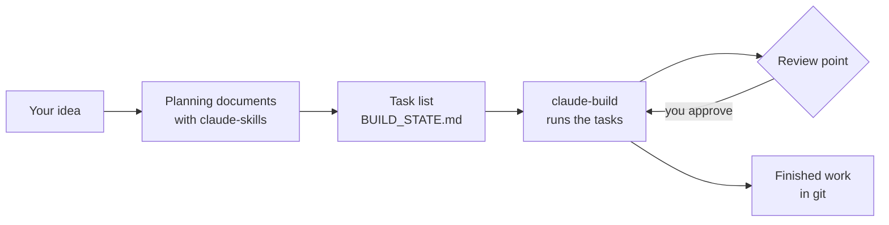

# claude-build

claude-build helps you turn a plan into working software with Claude Code, one approved task at a time. You give it a list of tasks. It asks Claude Code to work through them in order, saves each finished task in git, and stops at the checkpoints you choose so you can look at the work before it goes further.

It runs on your own computer, from the command line, and you can leave it running while you do something else.

*Updated 2026-10-09 for version 1.2.6. By A. Todd Emerson. Apache-2.0 license.*

---

**Contents**

Guide

1. [What claude-build does](#what-claude-build-does)
2. [Words used in this guide](#words-used-in-this-guide)
3. [Is it a good fit?](#is-it-a-good-fit)
4. [From an idea to a finished build](#from-an-idea-to-a-finished-build)
5. [Install](#install)
6. [Your first build, step by step](#your-first-build-step-by-step)
7. [Day to day](#day-to-day)
8. [Review points](#review-points)
9. [Fixing problems](#fixing-problems)
10. [Safety and cost](#safety-and-cost)
11. [Under the hood](#under-the-hood)
12. [Related projects](#related-projects)

Reference

13. [Commands](#commands)
14. [The task list file](#the-task-list-file)
15. [The settings file](#the-settings-file)
16. [Finding the settings and the project](#finding-the-settings-and-the-project)
17. [Files it writes](#files-it-writes)
18. [Exit codes](#exit-codes)
19. [Running on a schedule](#running-on-a-schedule)
20. [Custom prompts](#custom-prompts)
21. [Testing without spending tokens](#testing-without-spending-tokens)
22. [Troubleshooting table](#troubleshooting-table)
23. [License and contributing](#license-and-contributing)

---

# Guide

## What claude-build does

[Claude Code](https://docs.anthropic.com/en/docs/claude-code) can write and change software for you. A small change fits in one conversation. A whole application does not: the conversation grows too long, your plan's usage limit cuts it off, or a mistake early on goes unnoticed for hours.

claude-build breaks the work into short sessions. Before it starts, you approve a task list. Then it:

1. Reads the task list and finds the next task.
2. Starts a fresh Claude Code session for that task, using the model you picked for it.
3. Waits while Claude Code does the task, checks it, and saves it as a git commit.
4. Marks the task done and moves to the next one.
5. Stops at each review point you added, and when the list is finished.

If something goes wrong, it stops and writes a short report that tells you, in plain words, what happened and what to do next. If your usage limit runs out, it waits and tries again later. The waiting and checking cost nothing: only the Claude Code sessions use your plan's usage.

## Words used in this guide

| Word | Meaning here |
| --- | --- |
| Claude Code | Anthropic's command-line tool that lets Claude read, write, and run code in a folder on your computer. The command is `claude` |
| Session or run | One Claude Code conversation started by claude-build. A run does one or more tasks, then ends |
| Task list, or state file | A Markdown file, usually `BUILD_STATE.md`, with a table of tasks and a few status lines at the top. It is the build's memory |
| Model | The Claude model a task uses. `haiku` is fast and low-cost, `sonnet` handles most work, and `opus` is the strongest |
| Effort | The amount of thinking the model does before it acts: `low`, `medium`, `high`, `xhigh`, or `max` |
| Review point, or gate | A row in the task list that pauses the build so you can look at the work |
| Tokens | The units of text that Claude reads and writes. Your Claude plan or API account limits or bills them |
| Git and commit | Git keeps the history of a project's files. A commit is one saved step in that history, and you can return to any commit |
| Terminal | The command-line window where you type commands |
| Config, or settings file | `claude-build.conf`, a short text file with your project's settings |

## Is it a good fit?

claude-build suits a project with many steps that depend on each other, such as a new web service, a set of documents, or a move from one system to another. It works best when:

- you can describe the work as a list of tasks, each small enough for one session
- you want to choose which model, and how much thinking, each task gets
- you want the build to keep going through usage limits and crashes without you watching it
- you want to review the work at milestones you choose

It suits one project at a time, worked in order. If you have many unrelated tasks that should each end on their own git branch, look at claude-automation under [Related projects](#related-projects).

**You need:**

| Requirement | Notes |
| --- | --- |
| A Linux computer | macOS needs changes first (see [TODO.md](TODO.md)). Other systems are untested |
| Claude Code, installed and signed in | Sessions use your Claude plan's usage or your Anthropic API account |
| bash 4.4 or newer, and git | Standard on most Linux systems. Check with `bash --version` and `git --version` |
| `jq` (recommended) | Lets you watch progress live. Without it, you see each session's output when it ends |
| `curl` or `wget` | Only for installing |

## From an idea to a finished build

The quality of the build depends on the quality of the plan. A clear plan means fewer retries, lower cost, and work closer to what you wanted. claude-build handles the building. A companion project, [claude-skills](https://github.com/ToddE/claude-skills), handles the planning.



**1. Shape the idea.** claude-skills includes a set of planning skills for Claude. A skill is a packaged set of instructions that Claude follows for a specific job. Starting from an idea, they help you write:

| Document | It answers |
| --- | --- |
| PR/FAQ | The people the product serves, the problem it solves, and the reason someone would use it. Written as an imagined announcement plus questions and answers |
| Use cases | The steps a person takes to get something done with the product |
| Functional requirements | The things the software must do, each with an id you can trace |
| Test cases | The checks that prove each requirement works |
| Architecture review | A check of the planned design, with the changes to make before building |

You can do this in a claude.ai chat or in Claude Code. The claude-skills README explains how to install the skills, or how to try them in one chat without installing.

**2. Turn the plan into a task list.** You have three ways:

- **The `build-plan` skill** in claude-skills reads the documents above and writes the task list, a settings file, and project rules for Claude Code. It asks what it still needs, such as your programming language and the commands that check the work. It also confirms that every requirement has a task. This gives the best result.
- **`claude-build --init`** reads a plan you wrote, such as a `PLAN.md`, and drafts the task list for you. Good for smaller projects.
- **Write it yourself**, starting from [examples/BUILD_STATE.md](examples/BUILD_STATE.md).

[examples/PLAN.md](examples/PLAN.md) is a short plan in a shape that turns into a good task list, and [examples/BUILD_STATE.md](examples/BUILD_STATE.md) is the task list made from it.

**3. Review the task list.** Read it before you build. Claude Code works through the rows one session at a time, and a vague task wastes a session.

**4. Build, review, finish.** claude-build works through the list, pauses at your review points, and stops when the list is done.

## Install

Run this in a terminal:

```bash
curl -fsSL https://raw.githubusercontent.com/ToddE/claude-build/main/install.sh | bash
```

If you prefer to read the installer first:

```bash
curl -fsSLO https://raw.githubusercontent.com/ToddE/claude-build/main/install.sh
less install.sh
bash install.sh
```

The installer checks your bash version, lists any missing tools, downloads the latest release, and puts a `claude-build` command in `~/.local/bin`. It tells you if that folder is missing from your `PATH` (the list of folders your terminal searches for commands).

Check that it worked:

```bash
claude-build --version
```

**Updating.** `claude-build --check-update` tells you whether a newer version exists. `claude-build --update` installs it after asking you. claude-build uses the network for these two commands only. It does not check for updates on its own.

**Removing it.** `rm ~/.local/bin/claude-build && rm -r ~/.local/share/claude-build`

## Your first build, step by step

This walkthrough builds a project in a folder called `~/myapp`. Replace the name with your own.

**1. Make the project folder a git repository.** claude-build saves each task as a commit, so it needs git.

```bash
mkdir -p ~/myapp && cd ~/myapp
git init
echo ".build/" > .gitignore
git add .gitignore && git commit -m "Start"
```

The `.build/` folder holds claude-build's logs and reports. The `.gitignore` line keeps it out of your project's history.

**2. Add a settings file.** Create `~/myapp/claude-build.conf` with these lines:

```bash
PROJECT_NAME="myapp"
PROJECT_DIR="/home/you/myapp"
```

Use the full path to your folder. claude-build finds this file by itself when you run it from this folder. [examples/claude-build.conf](examples/claude-build.conf) lists every other setting, with an explanation of each.

**3. Get a task list.** If you used the `build-plan` skill, copy the `BUILD_STATE.md` it wrote into the folder and skip to step 4. Otherwise, put your plan in `PLAN.md` and ask claude-build to draft the list:

```bash
claude-build --init PLAN.md            # shows what it would do. Starts nothing
claude-build --init PLAN.md -m opus -r # writes BUILD_STATE.md, using the opus model
```

Commands without `-r` only show you what would happen. That makes it safe to try things. Add `-r` to do it for real.

If your plan leaves something unclear, `--init` lists the open questions at the end of `BUILD_STATE.md` and pauses the build until you answer them. Add `-I` to answer them in the terminal instead.

**4. Read and edit the task list.** Open `BUILD_STATE.md`. A row holds a task, a model, and an effort level. Change anything you disagree with. Section [The task list file](#the-task-list-file) explains the format.

**5. Preview the build.**

```bash
claude-build -v
```

This shows the project, the next task, the model and effort it will use, the commands Claude Code may run, and the exact instructions each session receives. It starts nothing.

**6. Start the build and watch it.**

```bash
claude-build -rv --watch
```

`-r` runs the build, `-v` shows more detail, and `--watch` shows a live dashboard:

```
⠹ ▒▓█▓▒░······················  working on task 2.2 (sonnet) 4m12s
██████░░░░░░░░░░░░░░ 16/66 (24%)  activity ▁▁▃▅█▂▁▁▄▆█▃▂▁▃▅▇█▄▂
================================================================
myapp build
  build loop: running (pid 1129519)
  status:     ready
  next:       2.2  Sign-up, verify, sign-in, and reset endpoints
  ...
-- recent activity (newest last) --
  ...
```

The moving bar shows that a session is working. The progress bar counts finished tasks. The activity line shows how busy the build was in each of the last 20 minutes.

To stop, press Ctrl+C once: the build finishes the task it is on, saves it, and stops. Press Ctrl+C twice to stop at once. claude-build keeps a copy of any unfinished work, and the next run picks up that task again.

**7. At a review point.** The build pauses and prints what it built, what to check, and the exact steps to continue. Section [Review points](#review-points) covers this.

**8. Finish.** The build prints a summary and writes a report to `.build/report-latest.md`. Look through the commits with `git log --oneline`. claude-build does not publish or deploy anything. Do that yourself when you are satisfied.

## Day to day

Run these from your project folder.

| To do this | Run |
| --- | --- |
| See what would happen, without starting anything | `claude-build -v` |
| Start the build in this window and watch it | `claude-build -rv --watch` |
| Start it in this window without the dashboard | `claude-build -rv` |
| Start it in the background, so you can close the window | `claude-build -b` |
| Start it in the background and watch it | `claude-build -b --watch` |
| Watch a build that is already running | `claude-build --watch` |
| Check progress once | `claude-build -s` |
| Stop after the task in progress | `claude-build -k` |
| Stop at once | `claude-build --kill-now` |
| Continue after a review point or a problem | `claude-build --ready`, then `claude-build -rv --watch` |
| Read the latest report | open `.build/report-latest.md` |
| See everything the sessions did | `less .build/build.log` |
| Get help from Claude with your setup | `claude-build --guide` |

**Changing the plan while you work.** Edit `BUILD_STATE.md` between runs. Set a row back to `todo` to redo it, add rows, or change `NEXT:` to jump to another task.

## Review points

A review point is a row in the task list whose task starts with `GATE`. The build stops there and prints a summary like this:

```
== PAUSED FOR REVIEW: 15 of 66 tasks done ==

  What was built: the workspace and a test that fills in a W-9 form.
  Why it stopped: the plan asks a person to look at the filled form.
  1. Open /home/you/myapp/tests/output/w9-render-sample.png ...

Step 1. Change one line in the state file
  File: /home/you/myapp/BUILD_STATE.md   (line 5, near the top)
  Now:     STATUS: gate
  Change:  STATUS: ready
  Shortcut: run claude-build --ready and it makes this edit for you.

Step 2. Start the build again
  Command: claude-build -rv
  ...
```

The "What was built" part comes from one short Claude session that explains the stop for someone who has not read the planning documents. The steps come from claude-build itself. The same summary, plus a list of what was built and what is left, goes into `.build/report-latest.md`.

To continue: do the review, run `claude-build --ready`, then start the build again.

**To finish part of the work by hand.** The report includes a prompt to paste into Claude Code, in a terminal or in an editor such as VS Code or VSCodium with the Claude Code extension. It gives Claude the situation and asks it to wait for you before it starts the next task.

**Review without stopping.** Add `GATE_MODE="continue"` to your settings file. The build then records each review point in the report and keeps going. A row whose task starts with `GATE!` still stops the build. Use `GATE!` for decisions that later work depends on.

**Automated checks at review points.** List the commands that prove your project works, such as its tests, in the `GATE_CHECKS` setting:

```bash
GATE_CHECKS=("npm test" "npm run lint")
```

claude-build runs these commands itself at each review point and at the end of the build. No model decides whether they passed. If one fails, claude-build starts a session that receives the failing command and its output, fixes the cause, and commits. Then it runs the checks again. It tries this twice by default, first with `sonnet` and then with `opus`. If the checks still fail, the build stops and the report shows the failure.

A fix could make a check pass by weakening a test. The report lists any test files a fix session changed, so you can look at them. Sessions are also asked to add tests for each milestone before its review point.

With `GATE_MODE="continue"` and `GATE_CHECKS` together, the build runs to the end without stopping, unless a check keeps failing or it reaches a `GATE!` row, and writes one report at the end. Add the check commands to `ALLOWED_TOOLS` as well, so sessions can run them, for example `"Bash(npm test:*)"`.

## Fixing problems

Start here when something looks wrong:

1. Run `claude-build -s` to see the status, the next task, and the end of the log.
2. Open `.build/report-latest.md` if the build stopped on its own.
3. Run `claude-build --guide`. It opens a Claude session that looks at your setup, asks what you want to do, and gives you the exact commands. It shows an estimate of the tokens it will use and asks before it starts.

Common situations:

| You see | It means | Do this |
| --- | --- | --- |
| A preview, and nothing runs | You left out `-r` or `-b` | Add `-r` or `-b` |
| `Nothing will run. --watch only watches` | `--watch` on its own does not start a build | Use `-rv --watch` or `-b --watch` |
| `state file not found` | No task list in the project | See step 3 of [Your first build](#your-first-build-step-by-step) |
| `No project folder` | claude-build cannot tell which folder to work in | Set `PROJECT_DIR` in `claude-build.conf`, or pass `-d FOLDER` |
| `waiting until 18:40 after a failed run` | A session failed, often from a usage limit | Leave it running. It tries again at that time |
| `BLOCKED` | The build needs a decision from you | Read the reason in the report, fix it, then `claude-build --ready` |
| The same task keeps repeating | Its row never became `done` | Look at the log and the row, then fix the task or mark it `done` |
| A session fails at once | Claude Code is signed out, or a command it needs is not allowed | Read the end of `.build/build.log`. See [The settings file](#the-settings-file) for `ALLOWED_TOOLS` |

The [Troubleshooting table](#troubleshooting-table) in the reference lists more.

## Safety and cost

**Nothing runs by accident.** Commands without `-r`, `-b`, or `-o` only show what would happen. Running `claude-build` with no options prints the help.

**Limited permissions.** Sessions may only use the tools and commands in the `ALLOWED_TOOLS` setting. The default list lets Claude Code read and edit files and make commits. It leaves out pushing to GitHub, deploying, and deleting.

**Your work is saved.** Claude Code commits each finished task to git, so you can undo any task. While a session works, claude-build saves a snapshot of unfinished files every 60 seconds, and again if the session fails or you stop it. A snapshot is a hidden git commit that does not touch your branch or your files. See [Files it writes](#files-it-writes) for how to look at one.

**One build at a time.** A lock file stops a second copy from starting in the same project.

**Your settings file runs as code.** claude-build reads `claude-build.conf` as a bash script, so use only settings files you wrote or checked. It refuses a file that other users can change.

**Cost.** Sessions use your Claude plan's usage or your API account. Waiting, checking, snapshots, and the dashboard cost nothing. To keep the cost down:

- pick the model for each task once, in the task list, instead of starting low and redoing work on a stronger model
- keep tasks small and specific, so each session reads less
- preview with `-v` before you run
- keep `TASKS_PER_RUN` low (2 or 3) for large tasks, so Claude Code commits more often

A failed session waits 1, 2, 4, then 6 hours before the next try. Two sessions in a row that finish nothing stop the build, so a broken task cannot keep spending.

## Under the hood

claude-build is one bash script. Between sessions, it runs plain shell commands and no model. One cycle goes like this:

1. Stops if someone asked it to stop.
2. Reads `STATUS:` from the task list. `ready` continues. `gate`, `blocked`, and `done` stop the build and write a report.
3. Waits, if a session failed recently.
4. Reads the next task's model and effort, and starts one Claude Code session with them. The session does that task and any following tasks that use the same model, up to `TASKS_PER_RUN`.
5. Checks that the session finished at least one task.
6. Waits 30 seconds, then repeats.

A session starts fresh and reads only the task list and the files the task needs. A crash or a usage limit costs at most the task in progress.

claude-build chooses the model for each session from the task list, so no model decides which model runs next.

## Related projects

Running `claude -p` (Claude Code without a chat window) in a loop, with progress kept in files and git, is often called the Ralph Wiggum loop. claude-build follows that pattern and adds a task list with a model per task, review points, waiting after failures, a list of allowed commands, snapshots, and reports.

- [Ralph Wiggum loop](https://kartit.net/blog/ralph-wiggum-technique.html): the original shell loop.
- [loopgen](https://github.com/pro-vi/loopy): generates the prompt, state, and queue files for a long-running loop.
- [claude-automation](https://pypi.org/project/claude-automation/): an overnight pipeline with plan, code, review, and test stages, and one git branch per task.
- [Orchestra](https://pkg.go.dev/github.com/MochaCosine1206/orchestra): a Go tool that runs `claude -p` rounds with limits on runaway loops.

---

# Reference

## Commands

Run `claude-build` with no options to print the full help.

claude-build only starts work with `-r`, `-b`, or `-o`, and you can use one of the three at a time. Options without a value can be combined behind one dash: `-rv` means `-r -v`. An option that takes a value goes last in a group: `-rvc myapp.conf`.

**Starting and stopping**

| Option | Does |
| --- | --- |
| `-r`, `--run` | Run the build in this window |
| `-b`, `--background` | Run the build in the background and give the window back. Closing the window does not stop it |
| `-o`, `--once` | Run one cycle and exit. For schedules (see [Running on a schedule](#running-on-a-schedule)) |
| `-k`, `--stop` | Stop after the session in progress finishes its task. Stops at once if no session is running |
| `--kill-now` | Stop at once. The task in progress stays `todo`, its files stay in the folder, and a snapshot keeps a copy |
| `--ready` | After a review point or a block, change `STATUS` to `ready`. Starts nothing |

**Watching**

| Option | Does |
| --- | --- |
| `-s`, `--status` | Print the status, the next task, recent tasks, and the end of the log |
| `--watch` | Live dashboard. Use it with `-r` or `-b` to start a build, or alone to watch a build that is already running |
| `-v`, `--verbose` | Print the status first. While running, show what Claude says, each edit, and commands such as tests and commits. File reads and searches collapse into one line that updates in place |
| `-V`, `--very-verbose` | Like `-v`, and also show each file read and search |

In `-r --watch`, Ctrl+C once stops after the current task, and twice stops at once. In `-b --watch`, Ctrl+C closes the dashboard and the build keeps running.

**Planning and help**

| Option | Does |
| --- | --- |
| `--init PLAN.md` | Draft the task list from your plan. Shows what it would do, until you add `-r`. It does not overwrite an existing task list |
| `-I`, `--interactive` | With `--init`: Claude asks you its questions in the terminal first |
| `--guide` | Open a Claude session that helps you with your setup. Asks before it uses tokens |
| `-h`, `--help` | Print the help |
| `--version` | Print the version |
| `--check-update` | Say whether a newer version exists |
| `--update` | Install the newest version, after asking |

**Settings you can set for one run** (each overrides the settings file)

| Option | Sets | Default |
| --- | --- | --- |
| `-c`, `--config FILE` | Settings file | `claude-build.conf` in this folder, else beside the script |
| `-d`, `--project DIR` | Project folder | `PROJECT_DIR` from the settings file |
| `-S`, `--state FILE` | Task list file | `BUILD_STATE.md` |
| `-l`, `--log-dir DIR` | Folder for logs and reports | `.build` |
| `-m`, `--model NAME` | One model for every task | From the task list |
| `-e`, `--effort LEVEL` | One effort level for every task | From the task list |
| `-t`, `--tasks-per-run N` | Most tasks per session | `5` |
| `-T`, `--timeout TIME` | Longest one session may run, such as `90m` or `3h` | `3h` |
| `-i`, `--context PATH` | File or folder each session starts reading from. Repeat for more | none |
| `-P`, `--prompt TEXT` | Instructions for each session | built in |
| `-f`, `--prompt-file FILE` | Read the instructions from a file | none |
| `-M`, `--permission-mode MODE` | Claude Code permission mode | `acceptEdits` |
| `-w`, `--interval SECONDS` | Wait when there is nothing to do or after a failure | `1200` |
| `-a`, `--after-run SECONDS` | Wait between sessions | `30` |

claude-build refuses these combinations and says why: two of `-r`, `-b`, `-o`; `-s` with a run option; `-k` or `--kill-now` with a run or status option; `--watch` with `-o`.

## The task list file

The task list is a Markdown file, `BUILD_STATE.md` by default. claude-build reads the top lines and the table, and Claude Code updates them after each task.

```
# Build state

STATUS: ready
NEXT: 1.1
BLOCKED_REASON:

| Id | Milestone | Task | Model | Effort | Status | Commit | Notes |
| --- | --- | --- | --- | --- | --- | --- | --- |
| 1.1 | M1 | Create the project layout from PLAN.md section 2. `npm test` runs | haiku | | todo | | |
| 1.2 | M1 | Design the module interface in docs/design.md | opus | high | todo | | |
| G1 | M1 | GATE. Review docs/design.md before the code is written | | | todo | | |
```

| Part | Rules |
| --- | --- |
| `STATUS:` | `ready` lets the build run. `gate` pauses for a review. `blocked` pauses for a problem and needs `BLOCKED_REASON`. `done` ends the build |
| `NEXT:` | The `Id` of the next task |
| `BLOCKED_REASON:` | The reason the build is blocked |
| `Id` and `Status` columns | Required. `Status` is `todo`, `doing`, or `done` |
| `Task` column | The instruction for the session. Name the file or section to read and a check that proves the task is done, such as a command that passes |
| `Model` column | `haiku`, `sonnet`, or `opus`. Empty uses `MODEL` from the settings file |
| `Effort` column | `low`, `medium`, `high`, `xhigh`, or `max`. Empty uses the model's usual level: `opus` high, `sonnet` medium, `haiku` low |
| `Commit` and `Notes` columns | Filled in by the sessions. A task that fails twice gets a diagnosis in Notes and moves to `opus` |
| Review rows | A task that starts with `GATE` pauses the build. `GATE!` pauses it even with `GATE_MODE="continue"` |
| `## Open questions` | Optional, after the table. `--init` lists unclear points here |

**Tips**

- A session sees its task row, the files it reads, and the project. Write each task so it makes sense on its own.
- Put tasks that use the same model next to each other. One session handles a run of same-model tasks, which saves start-up time.
- Write a literal `|` inside a cell as `\|`. The preview and `-s` warn about a row with the wrong number of cells.

## The settings file

`claude-build.conf` holds settings as `NAME=value` lines. It runs as bash, so it must belong to you and other users must not be able to change it. Order of priority: an option on the command line, then this file, then the built-in default.

[examples/claude-build.conf](examples/claude-build.conf) explains every setting and ends with ready-made combinations, such as one for documentation projects and one for overnight builds.

| Setting | Default | Meaning |
| --- | --- | --- |
| `PROJECT_NAME` | `build` | Name shown in messages |
| `PROJECT_DIR` | none | Full path to the project folder |
| `STATE_FILE` | `BUILD_STATE.md` | The task list |
| `CONTEXT_FILES` | none | Files or folders each session starts reading from, such as `("PLAN.md" "docs/")` |
| `PROMPT`, `PROMPT_FILE` | built in | Instructions for each session (see [Custom prompts](#custom-prompts)) |
| `MODEL` | `sonnet` | Model for tasks with no `Model` cell |
| `MODEL_FROM_STATE` | `1` | `1` uses each task's `Model` cell. `0` uses `MODEL` for every task |
| `EFFORT` | empty | Effort for tasks with no `Effort` cell and no model default |
| `EFFORT_FROM_STATE` | `1` | `1` uses each task's `Effort` cell |
| `EFFORT_DEFAULTS` | `("opus=high" "sonnet=medium" "haiku=low")` | Effort by model |
| `ALLOWED_TOOLS` | read, edit, write, search, `ls`, `cat`, and git status, diff, add, commit, log | The only tools and commands a session may use. Add your project's check commands, such as `"Bash(npm test:*)"`. Leave out push, deploy, and delete |
| `PERMISSION_MODE` | `acceptEdits` | Lets sessions edit files without asking |
| `TASKS_PER_RUN` | `5` | Most tasks per session |
| `TIMEOUT` | `3h` | Longest one session may run |
| `INTERVAL` | `1200` | Seconds to wait when there is nothing to do |
| `AFTER_RUN` | `30` | Seconds between sessions |
| `BACKOFF_STEPS` | `(3600 7200 14400 21600)` | Seconds to wait after the first, second, third, and later failures |
| `GATE_MODE` | `stop` | `continue` records review points and keeps going |
| `GATE_CHECKS` | none | Commands claude-build runs itself at each review point and at the end, such as `("npm test")` |
| `GATE_FIX_TRIES` | `2` | Fix sessions to try when a check fails, before the build stops |
| `FIX_MODELS` | `("sonnet" "opus")` | Model for each fix attempt, in order |
| `CHECK_TIMEOUT` | `30m` | Longest one check command may run |
| `TEST_GLOBS` | common test paths | Paths counted as tests when the report lists test files a fix changed |
| `REPORT` | `1` | `1` has a model explain each stop in plain words. `0` skips that call |
| `REPORT_MODEL`, `REPORT_EFFORT` | `sonnet`, `low` | Model for that explanation |
| `SNAPSHOT_EVERY` | `60` | Seconds between snapshots of unfinished work. `0` turns them off |
| `SNAPSHOT_KEEP` | `60` | Snapshots to keep |
| `STREAM` | `1` | Live progress (needs `jq`). `0` shows output when each session ends |
| `WATCH_EVERY` | `5` | Seconds between dashboard refreshes |
| `BG_WAIT_CEILING_MS` | `0` | Milliseconds a session waits for helper agents it started. `0` waits until `TIMEOUT` |
| `LOG_DIR` | `.build` | Folder for logs and reports |
| `REDACT_FILES` | `(".env.local")` | Files whose values `-s` hides in the log lines it prints |
| `CLAUDE_BIN` | `claude` | The Claude Code command. Use a full path for schedules |
| `EXTRA_CLAUDE_ARGS` | none | Extra options passed to `claude` |
| `REQUIRE_GIT` | `1` | `0` allows a folder without git. Not recommended |

## Finding the settings and the project

You can run claude-build from any folder.

| Item | Search order |
| --- | --- |
| Settings file | `-c FILE`, else `claude-build.conf` in the folder you are in, else `claude-build.conf` beside the script |
| Project folder | `-d DIR`, else `PROJECT_DIR` in the settings file, else the folder above the script if it is a git repository. If none of these applies, it stops and says so |
| Task list, context paths, log folder | Inside the project folder, unless you give a full path |
| `-c` and `-d` paths | Relative to the folder you typed the command in |

Run from the project folder with `claude-build.conf` in it, and you can leave out `-c` and `-d`. To manage several projects, give each its own settings file and pass `-c`.

## Files it writes

In the log folder, `.build` by default:

| File | Holds |
| --- | --- |
| `build.log` | The script's messages and the steps of the sessions |
| `report-latest.md` | The newest stop report. Older ones are `report-YYYY-MM-DD-HHMM.md` |
| `last-run.jsonl` | The raw output of the latest session |
| `costs.tsv` | The cost each session reported |
| `review-items.tsv` | Review points passed with `GATE_MODE="continue"`, with their check results |
| `checks-last.txt` | Output of the latest `GATE_CHECKS` run |
| `tests-changed.tsv` | Test files that fix sessions changed |
| `supervisor.log` | Messages from a background build |
| `watch-run.log` | Output of a build started with `-r --watch` |
| `build.lock`, `current_run` | The process id of the running copy, and the task it is on |
| `backoff_until`, `failures` | The wait after failures |
| `stop` | A stop request. `-k` creates it. Starting a build removes an old one |

Snapshots of unfinished work live in git, outside your branches:

```bash
git for-each-ref refs/claude-build/rescue                          # list them
git diff HEAD refs/claude-build/rescue/20261008-225133 --stat     # what one holds
git checkout refs/claude-build/rescue/20261008-225133 -- src/app.ts   # bring back a file
```

## Exit codes

| Code | Meaning |
| --- | --- |
| 0 | The build is done, you asked it to stop, or one `-o` cycle finished |
| 1 | It cannot start, for example the project is not a git repository |
| 2 | Blocked. Read the reason, fix it, then `--ready` |
| 3 | At a review point |
| 64 | A wrong option, a missing or unsafe settings file, a missing project or task list, `--watch` with nothing to watch, or an unknown `STATUS` |

## Running on a schedule

`-o` runs one cycle and exits, which suits cron (the Linux task scheduler). A schedule has a short `PATH`, so set `CLAUDE_BIN` to the full path of `claude` in your settings file.

```
# crontab -e
*/30 * * * * /home/you/.local/bin/claude-build -c /home/you/myapp/claude-build.conf -o >> /home/you/myapp/.build/cron.log 2>&1
```

A systemd user timer works the same way. Create `~/.config/systemd/user/claude-build.service`:

```
[Service]
Type=oneshot
ExecStart=/home/you/.local/bin/claude-build -c /home/you/myapp/claude-build.conf -o
```

and `~/.config/systemd/user/claude-build.timer`:

```
[Timer]
OnBootSec=5min
OnUnitActiveSec=30min

[Install]
WantedBy=timers.target
```

Then run `systemctl --user enable --now claude-build.timer`. Use one scheduler at a time. The lock stops two copies from running together.

## Custom prompts

A session receives a short set of instructions: read the task list, continue at `NEXT`, do up to `TASKS_PER_RUN` tasks, update the list and commit after each, stop at a review point or a problem, and do not deploy or push. claude-build adds rules about models, stop requests, and unfinished files from earlier sessions.

To replace the instructions, set `PROMPT` or `PROMPT_FILE`, or pass `-P` or `-f`. claude-build fills in these placeholders:

| Placeholder | Becomes |
| --- | --- |
| `{state_file}` | The task list file name |
| `{tasks_per_run}` | The `TASKS_PER_RUN` value |
| `{context}` | A sentence listing `CONTEXT_FILES`, or nothing |
| `{model}`, `{effort}` | The model and effort for this session |
| `{model_rule}` | Tells the session to stop before a task for a different model. Added at the end if you leave it out |

Preview the result with `claude-build -v`.

## Testing without spending tokens

Set `CLAUDE_BIN` to a script of your own that stands in for Claude Code. A stand-in that marks the next task `done` and advances `NEXT` lets you watch a whole build finish without a session. [CONTRIBUTING.md](CONTRIBUTING.md) has a short setup.

## Troubleshooting table

| You see | Cause | Fix |
| --- | --- | --- |
| The help prints and nothing starts | No options | Add `-r` to run, `-s` for status, or other options to preview |
| `PREVIEW ONLY` | No `-r`, `-b`, or `-o` | Add one |
| `Choose one of -r, -b, or -o` | Two run options | Use one |
| `refusing to use ... conf` | Another user can change the settings file | `chmod o-w claude-build.conf` |
| `cannot run: run git init first` | The project is not a git repository | `git init`, then make a first commit |
| `already running (pid ...)` | A copy is running for this project | Watch it with `--watch`, or stop it with `-k` |
| `No project folder` | No `-d`, no `PROJECT_DIR`, and the script is not inside a git repository | Set `PROJECT_DIR`, or pass `-d` |
| `state file not found` | No task list | Write one, or use `--init` |
| `unknown STATUS` | The `STATUS:` line is missing or misspelled | Fix the top of the task list |
| `0 0 done/total` in the preview | The table header lacks `Id` and `Status` | Match the header shown in [The task list file](#the-task-list-file) |
| A warning about cells in a row | A `\|` inside a cell, or a missing cell | Write `\|`, or fix the row |
| `waiting until HH:MM`, again and again | Repeated failures, often a usage limit | Read the end of `build.log`. The wait grows to 6 hours |
| `no task finished in that run` | A session ended without finishing its task | Read `build.log` and the latest report. Two in a row block the build |
| `Background tasks still running after 600s` in the log | A session handed work to a helper agent and ran out of waiting time | Upgrade to 1.2.4 or later, or remove `Agent` from `ALLOWED_TOOLS` |
| Works in a terminal, fails on a schedule | The schedule cannot find `claude` | Set `CLAUDE_BIN` to its full path |

## License and contributing

claude-build is copyright 2026 A. Todd Emerson and licensed under the [Apache License 2.0](LICENSE). If you share it, or a changed version, keep the [LICENSE](LICENSE) and [NOTICE](NOTICE) files with it.

Bug reports, fixes, and documentation are welcome. [TODO.md](TODO.md) lists open work, with macOS support the largest item. [CONTRIBUTING.md](CONTRIBUTING.md) explains how to test a change without spending tokens. [RELEASING.md](RELEASING.md) explains how releases are made.
